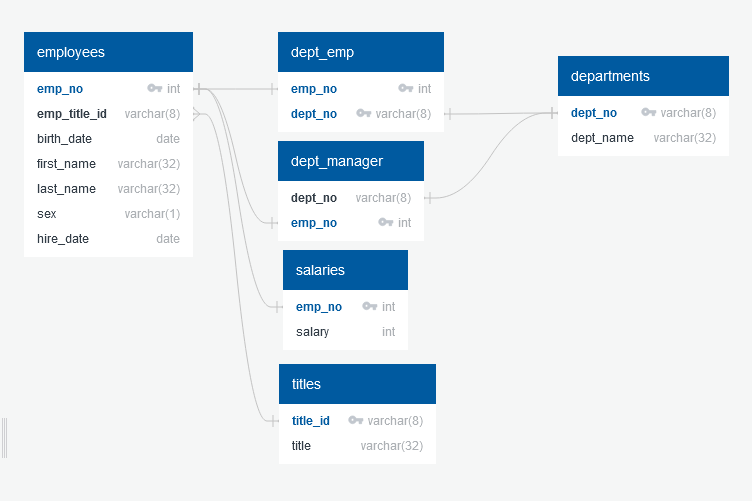

# Homework Assignment 7 - Database Modeling and Engineering

## Description

This image shows the relationships between the data. (It is also located inside the `erd` folder)

The schemata are located inside `schema/schema.sql`, for creating the tables based on the above relationships.

The analysis queries are located inside `query/query.sql`, along with comments as to which condition they satisfy.

## Notes

It probably would have been proper to set a composite key for `dept_managers`, same as `dept_emp`, but the data didn't require it and, since the data was from the 1980's/90's, nothing new should be added to it that would change that requirement.

The grading scale mentions a bonus analysis, but either I wasn't able to find what that bonus analysis was supposed to be, or directions for it weren't included, so it hasn't been included here.

### Sources

No code was copied/reused from external sources
